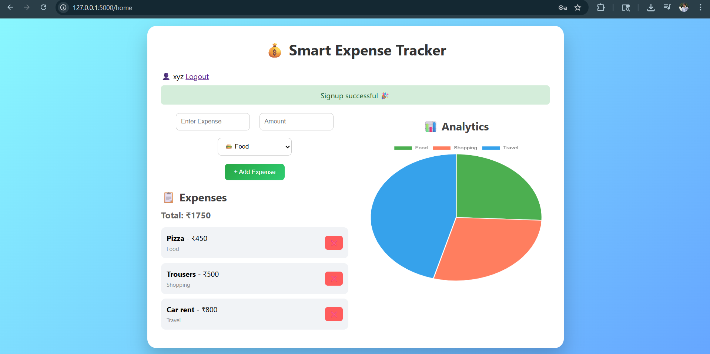
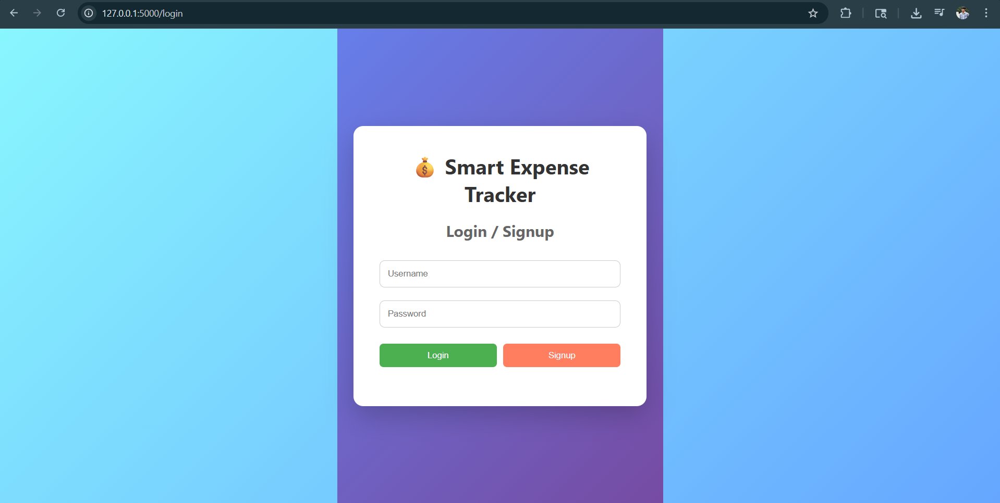

# 💰 Smart Expense Tracker

A fully deployed **full-stack expense tracking web application** built using Flask, JavaScript, and SQLite.

This project allows users to **track expenses, visualize spending patterns, and manage finances in real-time** through an intuitive and responsive interface.

---

## 🚀 Live Demo

🔗 https://smart-expense-tracker-0pon.onrender.com

---

## ✨ Key Features

* ➕ Add and manage daily expenses with categories
* 🗑️ Delete expenses instantly with real-time updates
* 📊 Interactive analytics using dynamic pie charts
* 🔐 User authentication (Login & Signup system)
* 💾 Persistent data storage using SQLite
* ⚡ Real-time UI updates using JavaScript (no page reload)
* 🎨 Clean, modern and responsive design

---

## 🛠️ Tech Stack

| Layer    | Technology Used           |
| -------- | ------------------------- |
| Frontend | HTML, CSS, JavaScript     |
| Backend  | Flask (Python)            |
| Database | SQLite                    |
| Charts   | Chart.js                  |
| Hosting  | Render (Cloud Deployment) |

---

## 📸 Screenshots

### 🖥️ Dashboard



### 🔐 Login Page



---

## ⚙️ Run Locally

```bash
git clone https://github.com/raghav-marda/smart-expense-tracker.git
cd smart-expense-tracker
pip install -r requirements.txt
python app.py
```

Open in browser:

```
http://127.0.0.1:5000
```

---

## 📂 Project Structure

```
smart-expense-tracker/
│
├── static/
│   ├── css/
│   └── js/
│
├── templates/
│   ├── index.html
│   └── login.html
│
├── app.py
├── requirements.txt
└── README.md
```

---

## 📈 Future Improvements

* 📅 Monthly & yearly expense reports
* 📤 Export data to PDF/Excel
* 🌙 Dark mode UI
* 🔐 Advanced authentication (hashed passwords)
* ☁️ Cloud database integration

---

## 👨‍💻 Author

**Raghav Marda**
B.Tech CSE Student
Interested in Web Development & Cybersecurity

---

## ⭐ Show Your Support

If you found this useful:

👉 Star the repository
👉 Share it on LinkedIn

---
